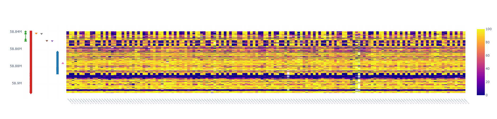

## METHYLMAP
### EXAMPLE

  

Methylmap is a tool for visualization of modified nucleotide frequencies for large cohort sizes, and allows for quick and easy consulting of nucleotide methylation frequencies of individuals in the 1000Genomes ONT project. 

The tools is available through bioconda and pypi, and can be installed using the following commands:
```
conda install -c bioconda methylmap
pip install methylmap
```

or through the methylmap web application at https://methylmap.bioinf.be.
 
If this application is useful for your research, please cite:
https://www.biorxiv.org/content/10.1101/2022.11.28.518239v1 (methylmap)


https://www.medrxiv.org/content/10.1101/2024.03.05.24303792v1 (the underlying 1000Genomes ONT dataset)

### METHYLMAP WEB APPLICATION
#### INPUT POSSIBILITIES 

The methylmap web application supports the visualization of own modification frequencies data by uploading a tab separated .tsv file. The file should contain the following columns: "chrom", "position", "sample_1", "sample_2", ... "sample_n". Example:
```
chrom	position	sample_1	sample_2	sample_3	sample_4
chr1	100000.0	0.000	0.167	0.000	0.077
chr1	100000.5	0.000	0.000	0.100	0.000
chr1	100001.0	0.000	0.000	0.000	0.222
chr1	100002.0	0.000	0.000	0.000	0.000
chr1	100003.0	0.000	0.000	0.000	0.000
```

Such a table can be generated using the multiparsetable.py script, that supports the following input possibilities:
- BAM/CRAM files with MM and ML tags. 

- files from nanopolish (as processed by calculate_methylation_frequency.py). The methylation calls can additionally be phased using the available scripts in the "scripts" folder.

### METHYLMAP COMMAND LINE TOOL
#### INPUT POSSIBILITIES
- BAM/CRAM files with MM and ML tags. Use --files input option and --fasta for the reference genome.
- files from nanopolish (as processed by calculate_methylation_frequency.py). The methylation calls can additionally be phased using the available scripts in the "scripts" folder. Use --files input option.
- an own tab separtated table with nucleotide modification frequencies over all positions (methfreqtable), required header names are "chrom" (column with chromosome information) and "position" (columns with position information). Use --table input option. Example:
```
chrom	position	sample_1	sample_2	sample_3	sample_4
chr1	100000.0	0.000	0.167	0.000	0.077
chr1	100000.5	0.000	0.000	0.100	0.000
chr1	100001.0	0.000	0.000	0.000	0.222
chr1	100002.0	0.000	0.000	0.000	0.000
chr1	100003.0	0.000	0.000	0.000	0.000
```
- a tab separated file with an overview table containing all nanopolish or BAM/CRAM files and their sample name and experimental group (header requires "path", "name" and "group"). Use --table input option. Example:
```
path    name    group
/home/path_to_file/bamfile_sample_1.bam   samplename_1    case
/home/path_to_file/bamfile_sample_2.bam   samplename_2    control
/home/path_to_file/bamfile_sample_3.bam   samplename_3    control
/home/path_to_file/bamfile_sample_4.bam   samplename_4    case
```

#### USAGE
```
usage: methylmap [-h] [-f FILES [FILES ...] | -t TABLE] [-w WINDOW] [-n [NAMES ...]] --gff GFF [--output OUTPUT] [--groups [GROUPS ...]]
                 [-s] [--fasta FASTA] [--mod {m,h}] [--hapl] [--dendro] [--threads THREADS] --db DB [--quiet] [--debug] [--host HOST]
                 [--port PORT] [-v]

Plotting tool for population scale nucleotide modifications.

options:
  -h, --help            show this help message and exit
  -f FILES [FILES ...], --files FILES [FILES ...]
                        list with BAM/CRAM files or nanopolish (processed with calculate_methylation_frequency.py) files
  -t TABLE, --table TABLE
                        methfreqtable or overviewtable input
  -w WINDOW, --window WINDOW
                        region to visualise, format: chr:start-end (example: chr20:58839718-58911192)
  -n [NAMES ...], --names [NAMES ...]
                        list with sample names
  --gff GFF, --gtf GFF  add annotation track based on GTF/GFF file
  --output OUTPUT       TSV file to write the overview table with modification frequencies to.
  --groups [GROUPS ...]
                        list of experimental group for each sample
  -s, --simplify        simplify annotation track to show genes rather than transcripts
  --fasta FASTA         fasta reference file, required when input is BAM/CRAM files or overviewtable with BAM/CRAM files
  --mod {m,h}           modified base of interest when BAM/CRAM files as input. Options are: m, h, default = m
  --hapl                display modification frequencies in input BAM/CRAM file for each haplotype (alternating haplotypes in methylmap)
  --dendro              perform hierarchical clustering on the samples/haplotypes and visualize with dendrogram on sorted heatmap as
                        output
  --threads THREADS     number of threads to use when processing BAM/CRAM files
  --quiet               suppress modkit output
  --host HOST           Host IP used to serve the application
  --port PORT           Port used to serve the application
  -v, --version         print version and exit
```
Important: When using the command line tool, data from the 1000Genomes ONT project is not available. Please use the web application for this data.
Important: Adding a GFF/GTF file is required, use the --gff/--gtf option.
Important: When using BAM/CRAM files as input, the --fasta option is required.
Important: When perfroming hierarchical clustering, missing values are imputed using the pandas interpolate method.


### MORE INFORMATION

More information: https://www.biorxiv.org/content/10.1101/2022.11.28.518239v1