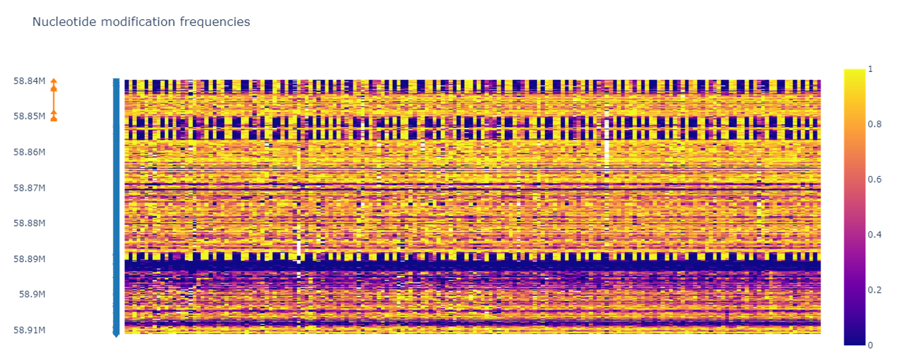

## METHYLMAP

Methylmap is a tool for visualization of modified nucleotide frequencies for large cohort sizes. 

### EXAMPLE

  

### INPUT POSSIBILITIES

Supported input possibilities are:

- BAM/CRAM files with MM and ML tags. Use --files input option.

- files from nanopolish (as processed by calculate_methylation_frequency.py). The methylation calls can additionally be phased using the available scripts in the "scripts" folder. Use --files input option.

- an own tab separtated table with nucleotide modification frequencies over all positions (methfreqtable), required header names are "chrom" (column with chromosome information) and "position" (columns with position information). Use --table input option. Example:
```
	chrom	position	sample_1	sample_2	sample_3	sample_4
0	chr1	100000.0	0.000	0.167	0.000	0.077
1	chr1	100000.5	0.000	0.000	0.100	0.000
2	chr1	100001.0	0.000	0.000	0.000	0.222
3	chr1	100002.0	0.000	0.000	0.000	0.000
4	chr1	100003.0	0.000	0.000	0.000	0.000
```

- a tab separated file with an overview table containing all nanopolish or BAM/CRAM files and their sample name and experimental group (header requires "path", "name" and "group"). Use --table input option. Example:
```
        path    name    group
0     /home/path_to_file/bamfile_sample_1.bam   samplename_1    case
1     /home/path_to_file/bamfile_sample_2.bam   samplename_2    control
2     /home/path_to_file/bamfile_sample_3.bam   samplename_3    control
3     /home/path_to_file/bamfile_sample_4.bam   samplename_4    case
````

### INSTALLATION

pip install methylmap

conda install -c bioconda methylmap

### USAGE

```
usage: methylmap [-h] (-f FILES [FILES ...] | -t TABLE) [-w WINDOW] [-n [NAMES ...]] [--gff GFF] [--expand EXPAND] 
[--outtable OUTTABLE] [--outfig OUTFIG] [--groups [GROUPS ...]] [-s] [--fasta FASTA] 
[--mod {5mC,5hmC,5fC,5caC,5hmU,5fU,5caU,6mA,5oxoG,Xao}] [--hapl] [--dendro] [-v]

Plotting tool for population scale nucleotide modifications.

options:
  -h, --help              show this help message and exit
  -f [FILES ...], --files [FILES ...]            
                          list with nanopolish (processed with calculate_methylation_frequency.py) files or BAM/CRAM files
  -t, --table             methfreqtable or overviewtable input
  -w, --window            region to visualise, format: chr:start-end (example: chr20:58839718-58911192)
  -n [NAMES ...], --names [NAMES ...]             
                          list with sample names
  --gff, --gtf            add annotation track based on GTF/GFF file
  --expand                number of base pairs to expand the window with in both directions
  --outtable              file to write the frequencies table to in tsv format
  --outfig                file to write output heatmap to, default: methylmap_{chr}_{start}_{end}.html (missing paths will be created)
  --groups [GROUPS ...]                
                          list of experimental group for each sample
  -s, --simplify          simplify annotation track to show genes rather than transcripts
  --fasta                 fasta reference file, required when input is BAM/CRAM files or overviewtable with BAM/CRAM files
  --hapl                  display modification frequencies in input BAM/CRAM file for each haplotype (alternating haplotypes in methylmap)
  --mod {5mC,5hmC,5fC,5caC,5hmU,5fU,5caU,6mA,5oxoG,Xao}                  
                          modified base of interest when BAM/CRAM files as input. Options are: 5mC, 5hmC, 5fC, 5caC, 5hmU, 5fU, 5caU, 6mA, 5oxoG, Xao, default = 5mC
  --dendro                perform hierarchical clustering on the samples/haplotypes and visualize with dendrogram on sorted heatmap as output
  -v, --version           print version and exit
  ```

### MORE INFORMATION

More information: https://www.biorxiv.org/content/10.1101/2022.11.28.518239v1